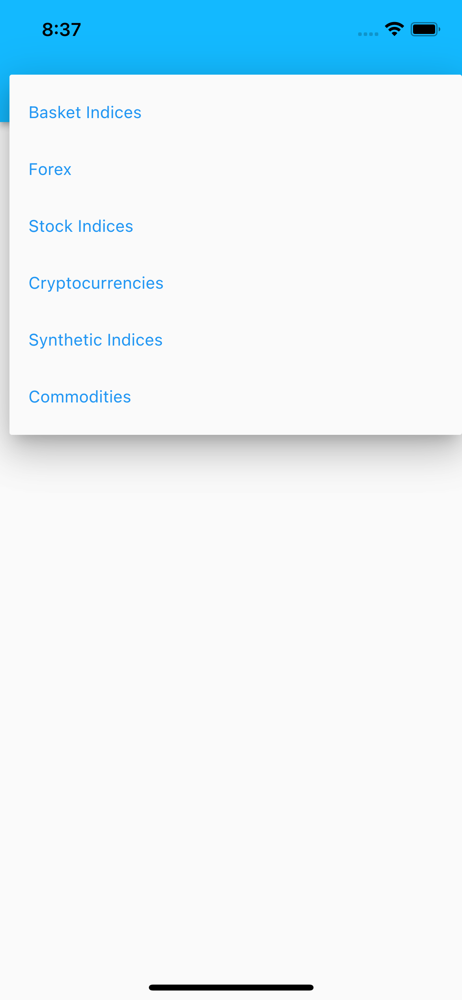
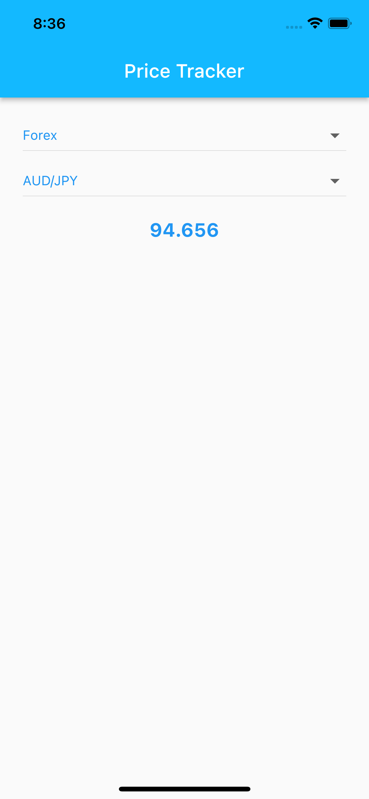

# Price Tracker

![coverage][coverage_badge]
[![style: very good analysis][very_good_analysis_badge]][very_good_analysis_link]
[![License: MIT][license_badge]][license_link]
[![Commitizen friendly][commitizen_friendly_badge]][commitizen_friendly_link]

A simple price tracker app.

---

## Features

- [x] The user can select and track the price of different markets using the given [service][price_tracker_url].

## Dependencies

- **[Flutter Bloc][flutter_bloc_link]** : State management & built in testing support.
- **[Web Socket Channel][web_socket_channel_link]** : Handling socket connections.
- **[Freezed][freezed_link]** & **[Json Serializable][json_serializable_link]**: Data classes and Json serialization.
- **[Mocktail](mocktail_link)** : For mocking dependencies.
- **[Very Good Cli](very_good_cli_link)** : Quickly bootstrapping projects with standard practices.

## Architecture & Processes

- Layered architecture with a good separation of concerns between the presentation layer, business logic, repositories & the network layer.
- Tried to follow TDD. Tested code. (Widget, Unit Tests. Need to add some Integration Tests)
- In par with the [Test Pyramid][test_pyramid_link]

## Improvements (if supported by the project timeline)

- [ ] More fined grained exception handling.
- [ ] Whiteboard different approaches and data types for handling error and data stream messages.
- [ ] Migrate to use RxDart and handle streams more efficiently depending on the use case (e.g. pause on background).
- [ ] Fix redundant and incomplete documentations.
- [ ] Refactor the tests to follow the robot testing pattern for better readability and maintenance.
- [ ] Add integration and E2E tests.
- [ ] Add localization to texts.


---

## Running the project 🚀

**Prerequisite**: Flutter installed on your device. Feel free to consult the [official docs][flutter_install_link].

This project contains 3 flavors:

- development
- staging
- production

To run the desired flavor either use the launch configuration in VSCode/Android Studio or use the following commands:

```sh
# Development
$ flutter run --flavor development --target lib/main_development.dart

# Staging
$ flutter run --flavor staging --target lib/main_staging.dart

# Production
$ flutter run --flavor production --target lib/main_production.dart
```

_\*Price Tracker works on iOS and Android._

---

## Running Tests 🧪

To run all unit and widget tests use the following command:

```sh
$ flutter test --coverage --test-randomize-ordering-seed random
```

To view the generated coverage report you can use [lcov](https://github.com/linux-test-project/lcov).

```sh
# Generate Coverage Report
$ genhtml coverage/lcov.info -o coverage/

# Open Coverage Report
$ open coverage/index.html
```

---

## App Screenshots

 

---

Generated by the [Very Good CLI][very_good_cli_link] 🤖

[coverage_badge]: coverage_badge.svg
[commitizen_friendly_badge]: https://img.shields.io/badge/commitizen-friendly-brightgreen.svg
[commitizen_friendly_link]: http://commitizen.github.io/cz-cli/
[web_socket_channel_link]: https://pub.dev/packages/web_socket_channel
[available_markets]: images/available_markets.png
[freezed_link]: https://pub.dev/packages/freezed
[flutter_install_link]: https://docs.flutter.dev/get-started/install
[flutter_bloc_link]: https://pub.dev/publishers/bloclibrary.dev/packages
[json_serializable_link]: https://pub.dev/packages/json_serializable
[license_badge]: https://img.shields.io/badge/license-MIT-blue.svg
[license_link]: https://opensource.org/licenses/MIT
[price_tracker_url]: https://developers.binary.com/
[mocktail_link]: https://pub.dev/packages/mocktail
[market_ticks_image]: images/market_ticks.png
[test_pyramid_link]: https://martinfowler.com/articles/practical-test-pyramid.html
[very_good_analysis_badge]: https://img.shields.io/badge/style-very_good_analysis-B22C89.svg
[very_good_analysis_link]: https://pub.dev/packages/very_good_analysis
[very_good_cli_link]: https://github.com/VeryGoodOpenSource/very_good_cli
